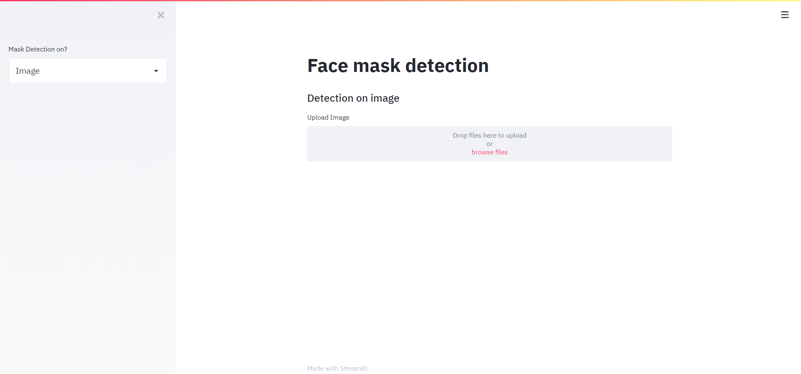
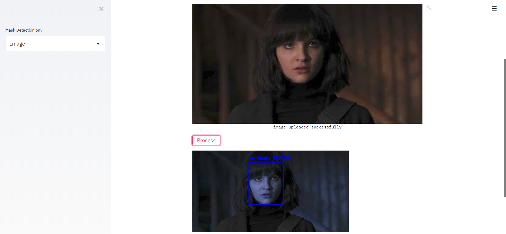
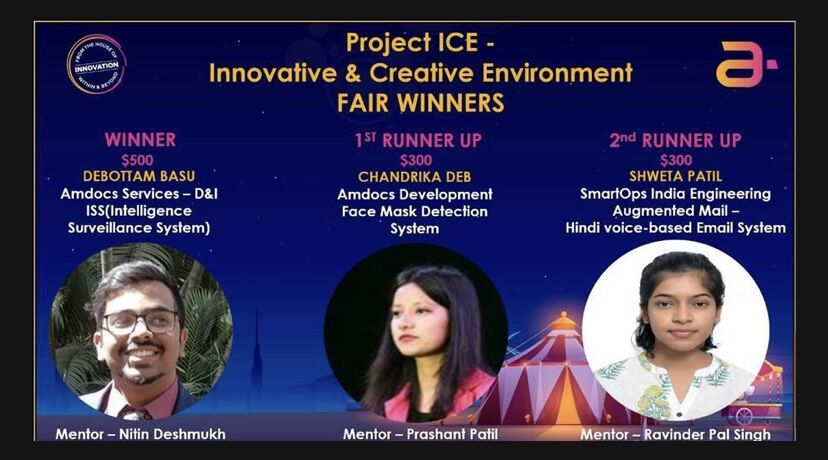
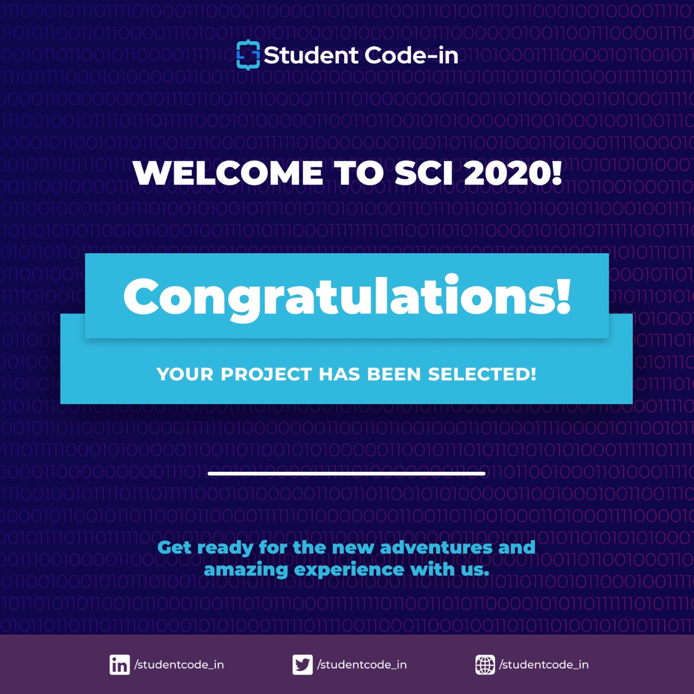

<h1 align="center">마스크 인식 시스템(Face Mask Detection)</h1>

<div align= "center">
  <h4>마스크 인식 시스템은 OpenCV, Keras/TensorFlow로 빌드되었으며, 딥 러닝, 컴퓨터 비전 개념을 사용하여 정적인 사진 또는 실시간 비디오에서 마스크 착용 여부를 인식합니다.</h4>
</div>

&nbsp;&nbsp;&nbsp;&nbsp;&nbsp;&nbsp;&nbsp;&nbsp;&nbsp;&nbsp;&nbsp;&nbsp;&nbsp;&nbsp;&nbsp;&nbsp;&nbsp;&nbsp;&nbsp;&nbsp;&nbsp;&nbsp;&nbsp;&nbsp;&nbsp;&nbsp;&nbsp;&nbsp;&nbsp;&nbsp;

[](https://github.com/chandrikadeb7/Face-Mask-Detection/issues)
[](https://github.com/chandrikadeb7/Face-Mask-Detection/network/members)
[](https://github.com/chandrikadeb7/Face-Mask-Detection/stargazers)
[](https://github.com/chandrikadeb7/Face-Mask-Detection/issues)
[](https://www.linkedin.com/in/chandrika-deb/)


&nbsp;&nbsp;&nbsp;&nbsp;&nbsp;&nbsp;&nbsp;&nbsp;&nbsp;&nbsp;&nbsp;&nbsp;&nbsp;&nbsp;&nbsp;&nbsp;&nbsp;&nbsp;&nbsp;&nbsp;&nbsp;&nbsp;&nbsp;&nbsp;&nbsp;&nbsp;&nbsp;&nbsp;&nbsp;&nbsp;&nbsp;&nbsp;&nbsp;&nbsp;&nbsp;


## :point_down: 후원하기!
<a href="https://www.buymeacoffee.com/chandrikadeb7" target="_blank"></a>

## :innocent: 제작 동기
코로나19 팬데믹이 계속되는 가운데에, 대중교통, 주택 지구, 대규모 제조업체 및 기타 기업들에서 안전을 위해 마스크 인식 시스템을 필요로 하는 수요가 높았지만, 효율적인 마스크 인식 시스템을 찾아보긴 어려웠습니다. __'마스크를 착용하고 있는'__ 대규모의 데이터가 없어서 이 작업에 어려움이 있었습니다. 

## PPT와 프로젝트 발표는 ₹1000 ($15, 약 16000원)에 구매하실 수 있습니다!
관심이 있으시다면 chandrikadeb7@gmail.com으로 연락 주세요!

# 🌟 [할인된 가격으로 구매하고 싶다면?](https://gum.co/GetFaceMask)
 
## :hourglass: 데포 버전
:movie_camera: [유튜브 링크](https://youtu.be/wYwW7gAYyxw)

:computer: [개발자 링크](https://dev.to/chandrikadeb7/face-mask-detection-my-major-project-3fj3)

[](https://face-mask--detection-app.herokuapp.com/)


<p align="center"></p>


## :warning: 사용된 TechStack/프레임워크

- [OpenCV](https://opencv.org/)
- [Caffe-based face detector](https://caffe.berkeleyvision.org/)
- [Keras](https://keras.io/)
- [TensorFlow](https://www.tensorflow.org/)
- [MobileNetV2](https://arxiv.org/abs/1801.04381)

## :star: 특징
우리 마스크 인식 시스템은 어떠한 형태로든 모프된 마스크 이미지 데이터셋을 사용하지 않았으며, 모델은 정확합니다. MobileNetV2 아키텍처의 사용으로, 계산상 효율을 챙겼으며, 이 모델을 라즈베리 파이, 구글 코랄과 같은 임베디드 시스템에 적용시키는 것이 쉬워졌습니다.

따라서 이 시스템은 코로나19로부터의 안전을 위해 실시간으로 마스크 감지를 할수 있는 어플리케이션 필요한 곳에서 사용할 수 있습니다. 이 프로젝트는 공항, 역, 사무실, 학교와 같은 임베디드 시스템과 통합하여 공공 안전 지침을 준수하는 데에 도움을 줄 수 있습니다.

## :file_folder: 데이터셋
사용된 데이터셋은 [여기](https://github.com/chandrikadeb7/Face-Mask-Detection/tree/master/dataset)서 다운로드 받을 수 있습니다.

데이터셋은 두 클래스로 나뉘어지는 __4095개의 이미지로__ 구성되어있습니다:
*	__마스크를 착용한 2165개의 사진__
*	__마스크를 착용하지 않은 1930개의 사진__

이미지는 실제로 마스크를 착용하고 있는 사진을 사용했습니다. 이미지는 다음과 같은 소스에서 수집하였습니다:
* __Bing 검색 API__ ([See Python script](https://github.com/chandrikadeb7/Face-Mask-Detection/blob/master/search.py))
* __Kaggle 데이터셋__ 
* __RMFD 데이터셋__ ([See here](https://github.com/X-zhangyang/Real-World-Masked-Face-Dataset))

## :key: 필요조건

필요한 모든 라이브러리는 <code>requirements.txt</code> 에 포함되어 있습니다 [바로가기](https://github.com/chandrikadeb7/Face-Mask-Detection/blob/master/requirements.txt)

## 🚀&nbsp; 설치하기
1. repository를 클론하세요.
```
$ git clone https://github.com/chandrikadeb7/Face-Mask-Detection.git
```

2. 경로를 클론한 repository의 위치로 변경하세요.
```
$ cd Face-Mask-Detection
```

3. 'test'라는 Python 가상환경을 만들고 작동하세요.
```
$ virtualenv test
```
```
$ source test/bin/activate
```

4. 그리고 필요한 라이브러리를 설치하기 위해 아래 명령어를 당신의 터미널/커맨드 프롬프트에 실행하세요.
```
$ pip3 install -r requirements.txt
```

## :bulb: 실행하기

1. 터미널을 열고 클론한 프로젝트가 있는 경로로 이동하세요. 그 후 아래 명령어를 입력하세요:
```
$ python3 train_mask_detector.py --dataset dataset
```

2. 사진에서의 마스크 착용여부를 확인하기 위해선 아래 명령어를 입력하세요:
```
$ python3 detect_mask_image.py --image images/pic1.jpeg
```

3. 실시간 영상에서의 마스크 착용여부를 확인하기 위해선 아래 명령어를 입력하세요:
```
$ python3 detect_mask_video.py 
```
## :key: 결과

#### 우리 모델은 <code>tensorflow-gpu==2.5.0</code>를 통한 학습 이후 98%의 정확도를 보여주고 있습니다.

<a href="https://colab.research.google.com/drive/1AZ0W2QAHnM3rcj0qbTmc7c3fAMPCowQ1?usp=sharing"></a>
####          


#### 우리는 훈련 기간동안 아래와 같은 정확도/놓침 변화를 가졌습니다.


## Streamlit 어플리케이션

Tensorflow & Streamlit를 사용해서 마스크 감지 시스템 웹 어플리케이션을 사용하세요!

명령어
```
$ streamlit run app.py 
```
## 실행 이미지

<p align="center">
  
</p>
<p align="center">이미지 업로드</p>

<p align="center">
  
</p>
<p align="center">결과</p>

## :clap: 이제 다 끝났습니다!
문의사항이나 의문이 있다면 자유롭게 이메일을 남겨주세요! 
:email: chandrikadeb7@gmail.com

---

## IoT 디바이스 설정

### 최소사양
* [케이스가 있는 Raspberry Pi 4 4GB](https://www.canakit.com/raspberry-pi-4-4gb.html)
* [Arducam의 5MP OV5647 PiCamera](https://www.arducam.com/docs/cameras-for-raspberry-pi/native-raspberry-pi-cameras/5mp-ov5647-cameras/)

### 시작하기
* Raspberry Pi 케이스를 설치하고 `documentation/CanaKit-Raspberry-Pi-Quick-Start-Guide-4.0.pdf`의 3페이지 Getting Started section 또는 https://www.canakit.com/Media/CanaKit-Raspberry-Pi-Quick-Start-Guide-4.0.pdf 에서 오퍼레이팅 시스템을 설정하세요.
  * 초보자라면 추천 오퍼레이팅 시스템을 사용하세요.
* PiCamera를 설정하세요.
  * `documentation/Arducam-Case-Setup.pdf` 또는 https://www.arducam.com/docs/cameras-for-raspberry-pi/native-raspberry-pi-cameras/5mp-ov5647-cameras/ 을 사용해서 Arducam에서 PiCamera를 설정하세요.
  * [PiCamera 모듈과 Raspberry Pi를 연결하고 카메라를 사용가능하게 설정하세요.](https://projects.raspberrypi.org/en/projects/getting-started-with-picamera/2)

### Raspberry Pi 어플리케이션 설치 및 실행

> 프로젝트를 클론한 후 아래 명령어를 실행하세요.

| 명령어                                                                                                |     소요시간     |
|------------------------------------------------------------------------------------------------------------------------------|--------------------|
| sudo apt install -y libatlas-base-dev liblapacke-dev gfortran                                                                | 1분                |
| sudo apt install -y libhdf5-dev libhdf5-103                                                                                  | 1분                |
| pip3 install -r requirements.txt                                                                                             | 1-3분              |
| wget "https://raw.githubusercontent.com/PINTO0309/Tensorflow-bin/master/tensorflow-2.4.0-cp37-none-linux_armv7l_download.sh" | 10초 이내          |
| ./tensorflow-2.4.0-cp37-none-linux_armv7l_download.sh                                                                        | 10초 이내          |
| pip3 install tensorflow-2.4.0-cp37-none-linux_armv7l.whl                                                                     | 1-3분              |

---

## :trophy: 수상
[Amdocs Innovation India ICE Project Fair]( https://www.amdocs.com/)에서 Runners Up 수상



## :raising_hand: 인용:

1. https://osf.io/preprints/3gph4/
2. https://link.springer.com/chapter/10.1007/978-981-33-4673-4_49
3. https://ieeexplore.ieee.org/abstract/document/9312083/
4. https://link.springer.com/chapter/10.1007/978-981-33-4673-4_48
5. https://www.researchgate.net/profile/Akhyar_Ahmed/publication/344173985_Face_Mask_Detector/links/5f58c00ea6fdcc9879d8e6f7/Face-Mask-Detector.pdf

## 👏 감사합니다!

### [Devscript Winter Of Code](https://devscript.tech/woc/) 에 선정


### [Script Winter Of Code](https://swoc.tech/project.html) 에 선정


### [Student Code-in](https://scodein.tech/) 에 선정


## :+1: 크레딧
* [https://www.pyimagesearch.com/](https://www.pyimagesearch.com/)
* [https://www.tensorflow.org/tutorials/images/transfer_learning](https://www.tensorflow.org/tutorials/images/transfer_learning)

## :handshake: 컨트리뷰션

#### [여기](https://github.com/chandrikadeb7/Face-Mask-Detection/blob/master/CONTRIBUTING.md)서 컨트리뷰션 가이드 라인을 꼭 읽어주세요!
 적절한 제목과 설명과 함께 [마스크 감지 시스템](https://github.com/chandrikadeb7/Face-Mask-Detection/issues)의 **새로운 issue를 자유롭게 제보 해주세요!**. 만약 이미 해결법을 이미 찾아셨다면, **Pull Request**는 항상 환영합니다!

## :handshake: 컨트리뷰터들

<a href="https://github.com/chandrikadeb7/Face-Mask-Detection/graphs/contributors">
  
</a>


## :eyes: 행위규범

우리의 행동규범은 [여기](/CODE_OF_CONDUCT.md)서 찾아 보실수 있습니다..


## :raising_hand: 인용에 대해

우리의 코드나 데이터셋 어디서든지 인용할 수 있습니다. 조사 연구나 프로젝트에도 사용할 수 있습니다. 이 repository에 링크를 멘션하거나 Chandrika Deb의 GitHub 프로필에 꼭 크레딧을 남겨주세요.

포멧:
- 작성자 이름 - Chandrika Deb
- 삽입구의 게시일 또는 업데이트 날짜
- 문서의 제목 또는 설명.
- URL.

## :heart: 오너
[Chandrika Deb](https://github.com/chandrikadeb7)이 사랑을 :heart:&nbsp;을 담아서 만들었습니다!

## :eyes: 라이센스
MIT 라이센스 © [Chandrika Deb](https://github.com/chandrikadeb7/Face-Mask-Detection/blob/master/LICENSE)

