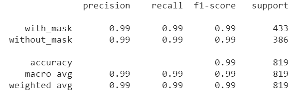
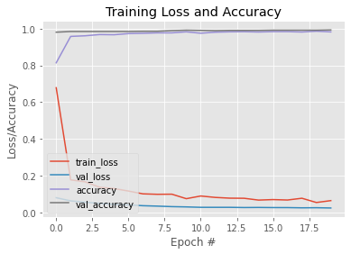
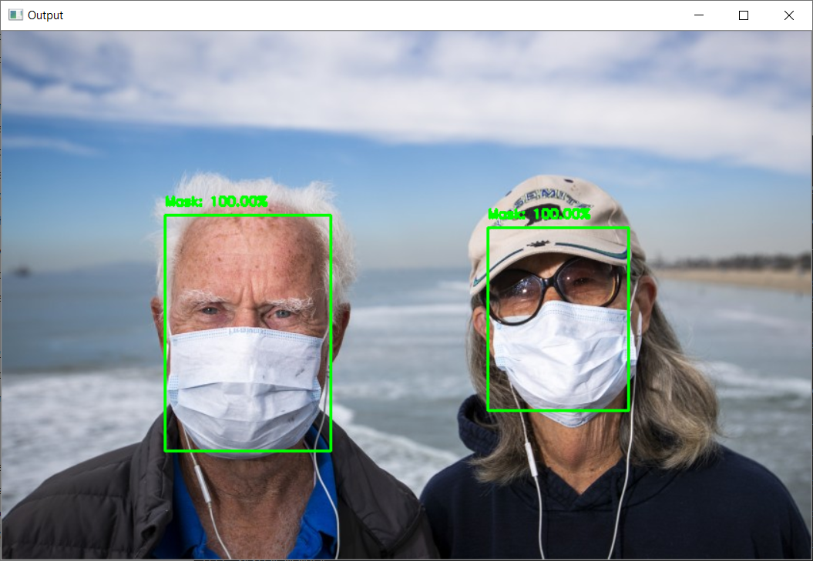
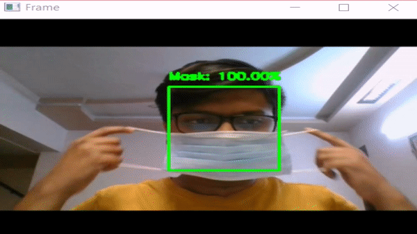

# Mask Detection using ResNet50 v2 


## 🚀&nbsp; Steps to run the ResNet50 v2

- To clone the Repository: <br>
```
git clone https://github.com/chandrikadeb7/Face-Mask-Detection.git
```
- Open terminal. Go into the cloned project directory and type the following command to train the model and create ResNet50_mask_detector.model file <br>
```
python3 ResNet50_v2/mask_with_resnet.py --dataset dataset --model "ResNet50_v2/ResNet50_mask_detector.model"
```

- To detect face masks in an image type the following command: <br>
```
python3 detect_mask_image.py --image images/pic1.jpeg --model ResNet50_v2/ResNet50_mask_detector.model
```


## :key:&nbsp; Result 



### Training Loss and Accuracy 


## :star:&nbsp; Output



## :star:&nbsp; Output Video


